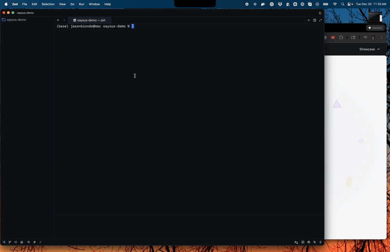

<p align="center">
  <a href="https://oaysus.com">
    
  </a>
</p>

<h1 align="center">Oaysus CLI</h1>

<p align="center">
  <strong>The visual page builder for developer-built components</strong>
</p>

<p align="center">
  Build components in React, Vue, or Svelte. Push with one command.<br />
  Let your team create pages visually.
</p>

<p align="center">
  <a href="https://oaysus.com/docs/quickstart"><strong>Documentation</strong></a> ·
  <a href="https://youtu.be/VlUNf-uZvTY"><strong>Watch Demo</strong></a> ·
  <a href="https://oaysus.com"><strong>Website</strong></a>
</p>

<p align="center">
  <a href="https://github.com/oaysus/cli/stargazers">
    
  </a>
  &nbsp;&nbsp;
  <a href="https://www.npmjs.com/package/@oaysus/cli">
    
  </a>
  <a href="https://opensource.org/licenses/MIT">
    
  </a>
</p>

<p align="center">
  <sub>If you find Oaysus useful, please consider giving us a ⭐ on GitHub!</sub>
</p>

<p align="center">
  <a href="https://youtu.be/VlUNf-uZvTY">
    
  </a>
  <br />
  <sub>From code to published page in seconds</sub>
</p>

---

## One command. Your component is live.

Watch how fast you can go from code to a published website with Oaysus.

```bash
oaysus theme init   # Pick your framework. Name your project.
oaysus theme push   # Your component builds and deploys in seconds.
```

No build pipelines. No complex deployments. Your marketing team creates pages visually, and you get back to building features.

## Installation

```bash
npm install -g @oaysus/cli
```

Requires Node.js 20 or higher.

## Quick Start

```bash
# 1. Authenticate with your Oaysus account
oaysus login

# 2. Create a new theme pack project
oaysus theme init my-components

# 3. Navigate to the project
cd my-components

# 4. Push your components to Oaysus
oaysus theme push
```

That's it. Your components are now available in the visual page builder.

```
✓ Validated 1 component
✓ Built and bundled (2.1 KB)
✓ Uploaded to Oaysus
✓ Published!

Install in dashboard: Content → Theme Packs
```

## Framework Support

Build with the tools you already know:

- **React** — JSX/TSX components with full hooks support
- **Vue** — Single File Components (.vue)
- **Svelte** — Native Svelte components (.svelte)

Framework is automatically detected from your `package.json` dependencies.

## How Components Work

Each component has two files: the code and a schema that defines what's editable.

**Component (React example):**
```tsx
export default function Hero({ headline, subtext, ctaLabel }) {
  return (
    <section className="py-20 text-center">
      <h1 className="text-5xl font-bold">{headline}</h1>
      <p className="mt-4 text-xl text-gray-600">{subtext}</p>
      <button className="mt-8 px-6 py-3 bg-blue-600 text-white rounded-lg">
        {ctaLabel}
      </button>
    </section>
  );
}
```

**Schema:**
```json
{
  "displayName": "Hero Section",
  "props": {
    "headline": {
      "type": "string",
      "default": "Build faster, ship sooner"
    },
    "subtext": {
      "type": "string",
      "default": "The platform for modern teams"
    },
    "ctaLabel": {
      "type": "string",
      "default": "Get Started"
    }
  }
}
```

Marketing edits these props in the visual editor. You never touch the code again.

## Commands

### Theme Pack Commands

Build and manage reusable component libraries.

| Command | Description |
|---------|-------------|
| `oaysus theme init` | Create a new theme pack project |
| `oaysus theme create` | Add a component to your theme pack |
| `oaysus theme validate` | Validate theme pack structure |
| `oaysus theme push` | Build and upload to Oaysus |
| `oaysus theme delete` | Delete a theme pack from Oaysus |

### Site Commands

Manage website pages and content.

| Command | Description |
|---------|-------------|
| `oaysus site init` | Create a new website project |
| `oaysus site validate` | Validate pages against installed components |
| `oaysus site publish` | Publish pages to your website |
| `oaysus site pull` | Download pages from server to local files |

### Global Commands

Authentication and account management.

| Command | Description |
|---------|-------------|
| `oaysus login` | Authenticate with your Oaysus account |
| `oaysus whoami` | Display current user information |
| `oaysus switch` | Switch between your websites |
| `oaysus logout` | Clear authentication tokens |

## Project Structure

```
my-components/
├── package.json
└── components/
    ├── Hero/
    │   ├── index.tsx
    │   └── schema.json
    ├── FeatureGrid/
    │   ├── index.tsx
    │   └── schema.json
    └── Testimonials/
        ├── index.tsx
        └── schema.json
```

## Why Oaysus?

| Traditional Approach | With Oaysus |
|---------------------|-------------|
| Marketing files a ticket for every page change | Marketing creates pages themselves |
| Developers build one-off landing pages | Developers build reusable components |
| Every text change requires a deploy | Changes publish instantly to global CDN |
| Locked into proprietary CMS themes | Standard React/Vue/Svelte you own |

## Documentation

- **[Quick Start Guide](https://oaysus.com/docs/quickstart)** — Build your first component in 5 minutes
- **[CLI Reference](https://oaysus.com/docs/cli)** — Complete command documentation
- **[Component Guide](https://oaysus.com/docs/components)** — Props, schemas, and best practices
- **[Theme Packs](https://oaysus.com/docs/theme-packs)** — Organize and distribute component collections

## Get Started

1. **[Create an account](https://oaysus.com/pricing)** — Free tier available
2. **Install the CLI** — `npm install -g @oaysus/cli`
3. **Follow the quick start** — [oaysus.com/docs/quickstart](https://oaysus.com/docs/quickstart)

## Contributing

We welcome contributions! See [CONTRIBUTING.md](CONTRIBUTING.md) for development setup.

## License

MIT © [Oaysus](https://oaysus.com)
